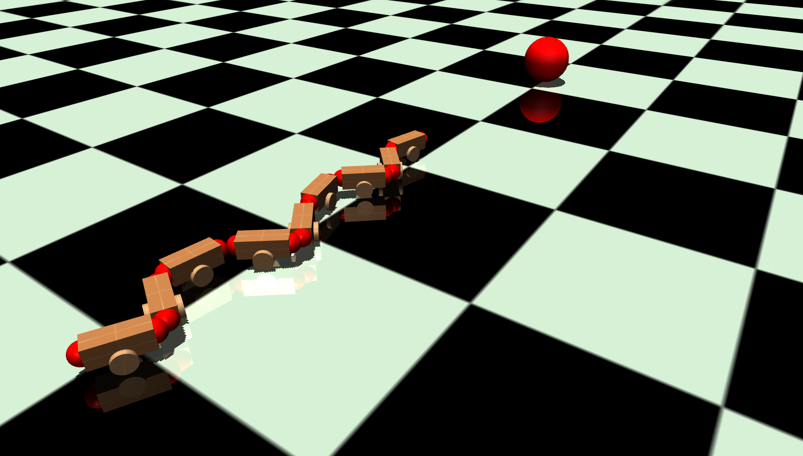

# Reinforcement Learning for Autonomous Locomotion Control of Snake-Like Robots
**Master's Thesis in Informatics**


Development of two artificial intelligent robot controllers.
First performs a power efficient locomotion at a specified velocity.
Second tracks a moving target using head camera images and follows it in a specified distance.


## Abstract


<p align="justify">
Similar to their biological counterparts, the flexible body shape of snake-like robots 
enables them to adapt their locomotion to diverse environments. With their advanced
movement capabilities, they are able to swim through water, climb stairs and go through
narrow spaces. This flexibility corresponds to a complex control problem with a high 
degree of freedom and an uncertain and dynamic dependency on different environmental
conditions, where traditional control engineering methods reach their limits. The purpose
of this thesis is to present a novel approach for solving such complex locomotion control
problems with Reinforcement Learning.<br/>
A planar snake-like robot model is developed and used in two autonomous motion 
control experiments. The first experiment examines a self-adaptive locomotion controller, 
by training a power efficient locomotion at a range of velocities. The resulting locomotion is
evaluated by comparing its power efficiency to a controller that was developed with the
traditional control engineering method. The second experiment performs a target tracking 
task in which the controller has to follow a moving target at a certain distance using a
vision sensor. The adaptability and stability of the controller is tested on unknown target
paths and on the accuracy of obtaining a specified distance to the target.
Both controller models are trained using Proximal Policy Optimization, a state-of-the-art
Reinforcement Learning algorithm for continuous control problems. The corresponding
observation space and reward function are defined in such manner that the algorithm can
achieve an independent solution without any prior human knowledge.<br/>
As a result, the Reinforcement Learning algorithm successfully generates an autonomous
locomotion controller for each task. The first controller outperforms the compared traditional 
controller in terms of power efficiency and shows a typical snake-like slithering motion pattern.
The second controller, solves the autonomous target tracking task by generating 
a locomotion controller that adapts its velocity and steering behavior to follow the
target using the head camera for vision.<br/>
This thesis offers contributions towards autonomous locomotion control of snake-like
robots by presenting an alternative to the traditional control engineering process by using
Reinforcement Learning.
</p>


## Setup


### System:
- Ubuntu 16.04 Xenial 
- Python 3.5 (try to avoid Anaconda, I had problems with it while installing mujoco)

### Requirements:
- Tensorflow
  - If GPU version: Might need cuda version 8. Might need specific nvidia driver "nvidia-384".

- mujoco 1.50
- mujoco-py >=1.50.1
- gym[mujoco]>=0.9.6'
- glfw>=1.4.0
- Cython>=0.27.2
- Baselines
- Pandas


### Installation:
For MuJoCo and mujoco-py follow the install instructions at https://github.com/openai/mujoco-py. Try to run the 
Install Gym at https://github.com/openai/gym. Try to run a mujoco example.


```bash
git clone https://github.com/Superchicken1/MasterThesis.git
cd gym_mujoco_planar_snake
pip install -e .
```
or add it in the PYTHONPATH like below.

### System Variables:
I can recomend to use the ~/.bashrc file to set system variables.

Add the following line to the end of the file:
```bash
# Used for tensorboard logs, benchmarks and models
export OPENAI_LOGDIR=$HOME/openai_logdir/tensorboard/x_new
export OPENAI_LOG_FORMAT="stdout,log,csv,json,tensorboard"

# Maybe needed for mujoco
export MUJOCO_PY_MJPRO_PATH=$HOME/.mujoco/mjpro150
export LD_LIBRARY_PATH=${LD_LIBRARY_PATH}:~/.mujoco/mjpro150/bin
#LD_LIBRARY_PATH=$HOME/.mujoco/mjpro150/bin pip install mujoco-py

# Alternative to pip
#export GYM_MUJOCO_PATH={path to project}/gym-mujoco-planar-snake
#export PYTHONPATH="$GYM_MUJOCO_PATH/gym-mujoco-planar-snake:$PYTHONPATH"

# Some fixes to get GLEW to work. Uncomment if needed
# GODLIKE FIX ... GLEW init error
#export LD_PRELOAD=/usr/lib/x86_64-linux-gnu/libGLEW.so:/usr/lib/nvidia-384/libGL.so
# X Error of failed request:  BadAccess (attempt to access private resource denied)
#export QT_X11_NO_MITSHM=1

```

### Run it
Be sure you set up the openai_logdir directory (did't test jet if directorys have to be created).
For parameters info use --help or look into run_mujoco_ppo.py.
At the moment at every start, a empty GLEW windows opens up with fullscreen. Do not close it just minimize it.


#### 1. Experiment: Power efficient locomotion 
**PPO controller:**

Train:
```bash 
gym_mujoco_planar_snake/agents/run_mujoco_ppo.py --train=1 --env Mujoco-planar-snake-cars-angle-line-v1
```
The model is stored in OPENAI_LOGDIR/models/ENV/PPO.

Enjoy:
```bash 
gym_mujoco_planar_snake/agents/run_mujoco_ppo.py --env Mujoco-planar-snake-cars-angle-line-v1
```

Evaluate:
```bash 
gym_mujoco_planar_snake/agents/run_mujoco_ppo.py --env Mujoco-planar-snake-cars-angle-line-v1 --evaluate_power_velocity
```
The results are stored in OPENAI_LOGDIR/power_velocity.


**Equation controller:**

Enjoy:
```bash 
gym_mujoco_planar_snake/agents/run_mujoco_coded_control.py --env Mujoco-planar-snake-cars-angle-line-v1
```

Evaluate:
```bash 
gym_mujoco_planar_snake/agents/run_mujoco_coded_control.py --env Mujoco-planar-snake-cars-angle-line-v1 --evaluate_power_velocity
```
The results are stored in OPENAI_LOGDIR/power_velocity.


Create comparison plot:
```bash 
gym_mujoco_planar_snake/benchmark/plots.py
```
First change the corresponding filenames in the evaluate_locomotion_control() method.
Check which evaluation is active in main(). 
The results are stored in OPENAI_LOGDIR.


#### Plots and data
See the files in directory [gym_mujoco_planar_snake/benchmark/plot_data].


